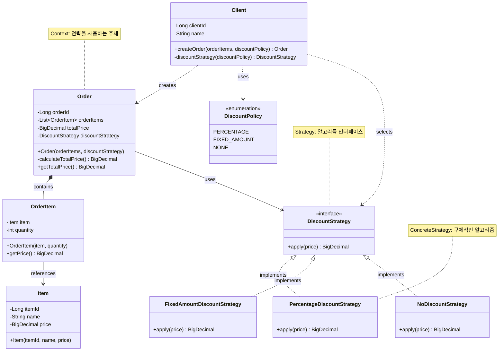

# 전략 패턴

여러 알고리즘을 캡슐화하여 런타임 환경에서 상황에 맞는 전략을 선택하여 사용할 수 있게 하는 패턴

## 예시 코드의 다이어그램

동적으로 DiscountStrategy를 선택하여 주문의 총액을 계산

```mermaid
classDiagram
    class Client {
        -Long clientId
        -String name
        +createOrder(orderItems, discountPolicy) Order
        -discountStrategy(discountPolicy) DiscountStrategy
    }
    
    class Order {
        -Long orderId
        -List~OrderItem~ orderItems
        -BigDecimal totalPrice
        -DiscountStrategy discountStrategy
        +Order(orderItems, discountStrategy)
        -calculateTotalPrice() BigDecimal
        +getTotalPrice() BigDecimal
    }
    
    class OrderItem {
        -Item item
        -int quantity
        +OrderItem(item, quantity)
        +getPrice() BigDecimal
    }
    
    class Item {
        -Long itemId
        -String name
        -BigDecimal price
        +Item(itemId, name, price)
    }
    
    class DiscountStrategy {
        <<interface>>
        +apply(price) BigDecimal
    }
    
    class PercentageDiscountStrategy {
        +apply(price) BigDecimal
    }
    
    class FixedAmountDiscountStrategy {
        +apply(price) BigDecimal
    }
    
    class NoDiscountStrategy {
        +apply(price) BigDecimal
    }
    
    class DiscountPolicy {
        <<enumeration>>
        PERCENTAGE
        FIXED_AMOUNT
        NONE
    }
    
    Client ..> Order : creates
    Client ..> DiscountPolicy : uses
    Client ..> DiscountStrategy : selects
    
    Order *-- OrderItem : contains
    Order --> DiscountStrategy : uses
    
    OrderItem --> Item : references
    
    DiscountStrategy <|.. PercentageDiscountStrategy : implements
    DiscountStrategy <|.. FixedAmountDiscountStrategy : implements
    DiscountStrategy <|.. NoDiscountStrategy : implements
    
    note for Order "Context: 전략을 사용하는 주체"
    note for DiscountStrategy "Strategy: 알고리즘 인터페이스"
    note for PercentageDiscountStrategy "ConcreteStrategy: 구체적인 알고리즘"
```